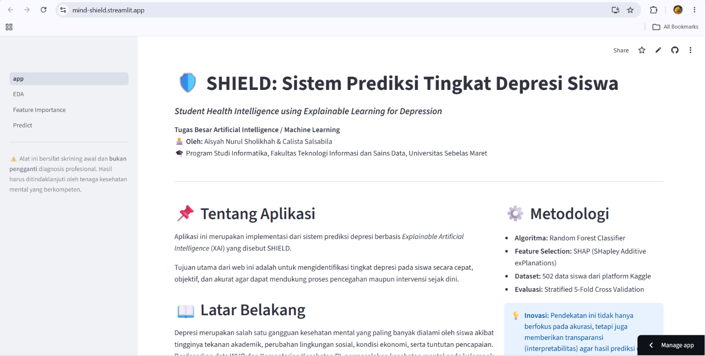
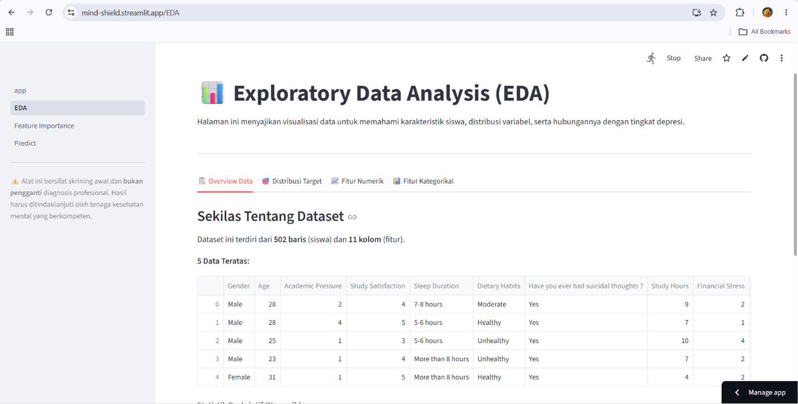
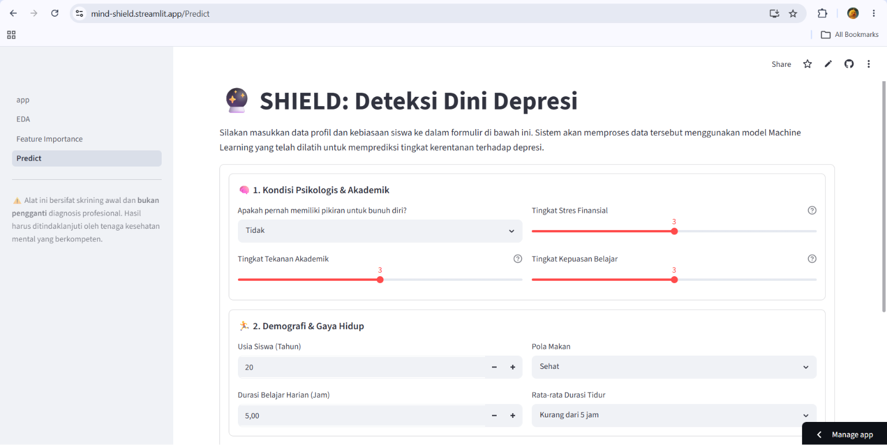
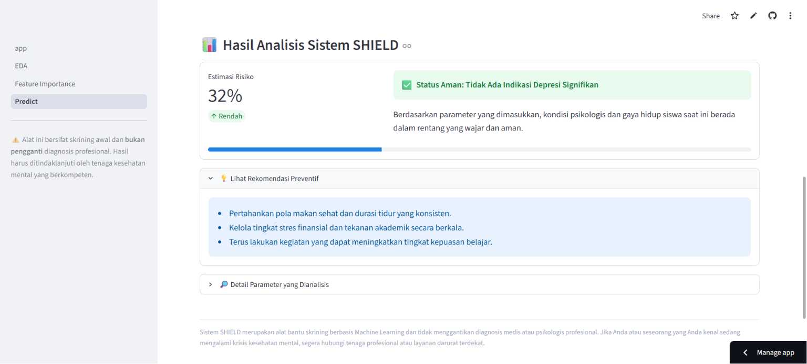
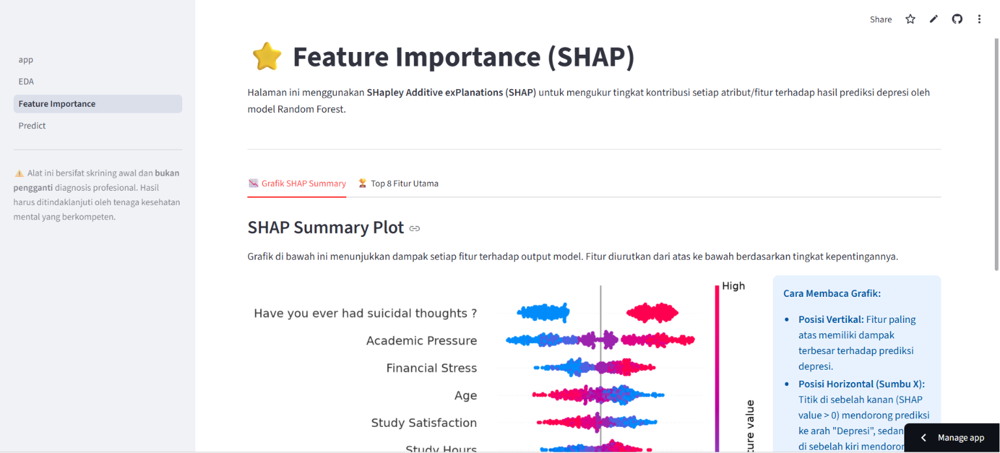

# 🛡️ SHIELD
## Student Health Intelligence using Explainable Learning for Depression

SHIELD is an Explainable Artificial Intelligence (XAI)-based web application developed to support the **early detection of depression among university students**. The system utilizes the **Random Forest** algorithm combined with **SHAP (SHapley Additive exPlanations)** to provide not only prediction results but also transparent explanations of the factors influencing each prediction.

This project was developed as part of a Machine Learning research project by modifying a previous study on student depression classification through the integration of **Random Forest**, **SHAP-based feature selection**, and **Explainable AI**.

---

## 👥 Project Team

SHIELD is the result of a collaborative effort between **[Calista Salsabila](https://github.com/calistasalsabila)** and **[Aisyah Nurul Sholikhah](https://github.com/arluxsho)**, developed as the final project for the Artificial Intelligence Class.

Rather than dividing responsibilities into separate roles, we worked together across every aspect of the project—from research and data analysis to machine learning model development, explainable AI implementation, web application development, deployment, and documentation.

This collaborative approach allowed us to combine our ideas and technical skills to build an end-to-end AI solution that is accurate, interpretable, and ready for real-world deployment.

---

## 🌐 Live Demo

🔗 **Web Application**

https://mind-shield.streamlit.app/

---

## 📄 Research Paper

The complete research paper describing the proposed methodology, experiments, feature selection process, model evaluation, and system implementation can be accessed below.

📖 **Read Full Paper**

🔗 **[Google Drive Paper Link Here](https://drive.google.com/file/d/1abGlY-RirE4hseyviy2fRCydOfjSZH0X/view?usp=drive_link)**

---

## 📌 Project Overview

Depression is one of the most common mental health issues experienced by university students. Academic pressure, financial stress, unhealthy lifestyles, and psychological factors can significantly affect students' well-being and academic performance.

SHIELD was developed to provide an **early screening tool** capable of predicting depression risk using Machine Learning while maintaining transparency through Explainable Artificial Intelligence (XAI).

Unlike conventional prediction systems that only produce classification results, SHIELD also explains **why** a prediction is made, allowing users to better understand the contributing factors behind each prediction.

It is important to note that **SHIELD is not intended to replace professional psychological or psychiatric assessments**. The application serves solely as an **early screening and decision-support tool** based on machine learning predictions. Any indication of depression should be followed by consultation with qualified mental health professionals for proper diagnosis and treatment.

---

## ✨ Features

- 🧠 Student Depression Prediction
- 🌳 Random Forest Classification
- 🔍 SHAP Explainable AI
- 📊 Feature Importance Visualization
- 🌐 Interactive Streamlit Dashboard
- 📈 Early Mental Health Screening

---

## 📂 Dataset

**Depression Student Dataset**

Source:

https://www.kaggle.com/datasets/ikynahidwin/depression-student-dataset

The dataset contains demographic, academic, lifestyle, and mental health attributes collected from university students.

### Features

- Age
- Academic Pressure
- Study Satisfaction
- Sleep Duration
- Dietary Habits
- Have You Ever Had Suicidal Thoughts?
- Study Hours
- Financial Stress

Target Variable

- Depression (Yes / No)

---

## 🧠 Machine Learning Workflow

```text
Student Dataset
        │
        ▼
Data Preprocessing
        │
        ▼
Label Encoding
        │
        ▼
Random Forest Baseline
        │
        ▼
SHAP Feature Importance
        │
        ▼
Top Feature Selection
        │
        ▼
Random Forest Training
        │
        ▼
Stratified 5-Fold Cross Validation
        │
        ▼
Model Evaluation
        │
        ▼
FastAPI Deployment
        │
        ▼
Streamlit Web Application
```

---

## ⚙️ Technologies Used

### Machine Learning

- Python
- Scikit-learn
- Random Forest
- SHAP
- Pandas
- NumPy

### Visualization

- Matplotlib
- Seaborn

### Backend

- FastAPI

### Frontend

- Streamlit

---

## 📊 Model Evaluation

The model performance was evaluated using:

- Accuracy
- Precision
- Recall
- F1-Score
- Confusion Matrix
- Stratified 5-Fold Cross Validation

SHAP-based feature selection successfully reduced the number of features while maintaining high predictive performance and improving model interpretability.

---

## 🖥️ System Interface

The SHIELD web application provides:

- Interactive Dashboard
- Student Screening Form
- Depression Prediction
- Prediction Probability
- SHAP Feature Importance
- Result Interpretation

---

## 🚀 Installation

### Clone Repository

```bash
git clone https://github.com/ArluxSho/mind-shield.git
```

Move into the project folder

```bash
cd shield
```

Install dependencies

```bash
pip install -r requirements.txt
```

Run Streamlit

```bash
streamlit run app.py
```

---

## 📷 Screenshots

- Dashboard


- Exploratory Data Analyis


- Prediction Form


- Prediction Result


- SHAP Feature Importance


---

## 🎯 Research Contribution

This research extends previous work on student depression classification by introducing several improvements:

- Replacing the previous classification model with **Random Forest**.
- Applying **SHAP** for explainable feature selection.
- Identifying the most influential features contributing to depression prediction.
- Reducing feature dimensionality while maintaining predictive performance.
- Developing an Explainable AI web application (**SHIELD**) for practical early depression screening.

---

## 📈 Future Development

Potential future improvements include:

- Hyperparameter Optimization
- Larger Multi-Institution Dataset
- Multi-Class Depression Severity Classification
- Mobile Application Development
- Integration with University Counseling Services
- Cloud Deployment

---

## 📚 Research Foundation

SHIELD is an extension of the research conducted by **Risqi et al. (2025)** on student depression classification.

The original study evaluated the performance of **Decision Tree** and **Support Vector Machine (SVM)** algorithms for predicting student depression. In this project, we further developed the proposed methodology by replacing the classification model with **Random Forest**, integrating **SHAP (SHapley Additive exPlanations)** for feature selection and model interpretability, applying **Stratified 5-Fold Cross Validation** for robust evaluation, and deploying the solution as an Explainable AI web application named **SHIELD**.

These enhancements aim to improve model interpretability, reduce feature dimensionality, and provide a practical tool for early depression screening among university students.

### Original Research

Risqi, M.K., Prastya, I.W.D., & Vikri, M.J. (2025). *Comparison of Decision Tree Algorithms and Support Vector Machine (SVM) in Depression Classification in Students.* Eduvest – Journal of Universal Studies, 5(4).

📄 **Journal Article:**  

https://eduvest.greenvest.co.id/index.php/edv/article/view/51108

---

## 📜 License

This project was developed for academic purposes as part of a Machine Learning research project.

---

## ⭐ Support

If you find this project useful, consider giving it a ⭐ on GitHub.

Thank you for visiting the SHIELD repository!
